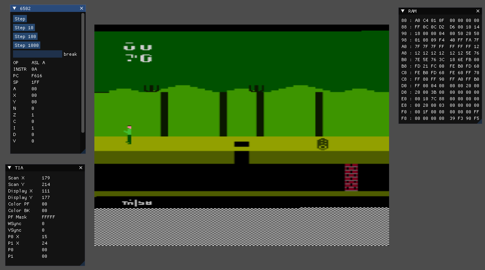

# Instroduction
An attempt to build enough of an Atari2600 emulator to play Pitfall.



# Install
```
apt-get install freeglut3-dev
```

```
git submodule init
git submodule update
```

# ROMS
https://www.atarimania.com/rom_collection_archive_atari_2600_roms.html

# Build
```
mkdir build
cmake
make
```

# Running
```
./imgui_main <romfile>
```

# DASM Assembler
Use DASM to build instruction test ROM.
The instruction test ROM is an attempt to have a some type of unit test for instruction implementation.
For each instuction (really group of instructions) work correctly, an value RAM should have a value written
that is 0x80 less than it's address, so RAM address 0x80 should contain value of 0, and address 0x81 has
a value of 1.

https://dasm-assembler.github.io/

```
export PATH=$PATH:/<path-to-dasm>
```

Build instruction test ROM
```
dasm instr_test.asm -f3 -oinstr_test.rom && hd instr_test.rom
```

# XA Assembler
The XA assembler is easy to install in Ubuntu, but pretty limited.
Playfield colors just changes the backgroud colors each line, while
trying to set a player sprites.

https://manpages.ubuntu.com/manpages/trusty/man1/xa.1.html

```
sudo apt-get install xa65
```

set text section to start at 0xF000 = 61440
```
xa input.asm -bt61440
```

```
xa -bt61440 playfield_colors.asm -o playfield_colors.bin && ./set_start_address.py playfield_colors.bin
```

# Stella
Stella is a much better Atari200 emulator, use it instead
https://stella-emu.github.io/docs/debugger.html#BreakpointStatus


# Memory Map
```
0000-002C TIA (Write)
0030-003D TIA (Read)
0080-00FF RIOT RAM
0280-0297 RIOT I/O, TIMER
F000-FFFF ROM
```

```
Reset vector : FFFC & FFFD
```

# TOOD
- [ ] Complete ASM test file (DASM)
- [ ] Show, reset, reflect, P0 and P1
- [ ] Repeat P0,P1, delay RES0,RES1 by one line
- [ ] Draw priority
- [ ] Draw delay
